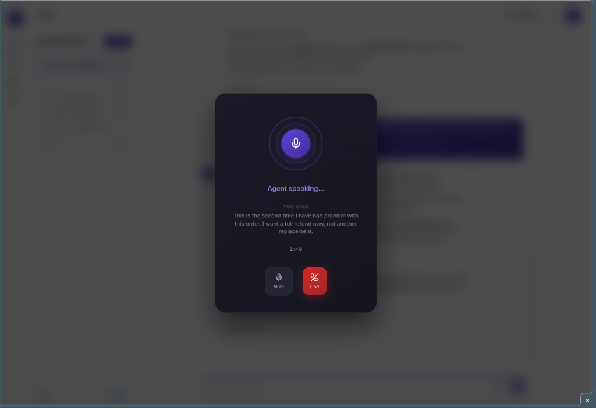

# SupportForge API

> Production-grade AI customer support agent — Backend API


## 🎬 Demo

[](https://youtu.be/CP3tsJpi1q4)

> 3-minute walkthrough: live chat with RAG streaming, anti-hallucination guard, smart escalation, admin panel, and analytics dashboard.

## Overview

SupportForge is a multi-tenant AI customer support agent powered by Ollama (self-hosted) and Google Gemini (cloud) LLMs, RAG (Retrieval-Augmented Generation) via LangGraph, and real-time WebSocket streaming. It provides intelligent, context-aware responses grounded in your organization's knowledge base.

### Key Features

- **RAG Pipeline** — LangGraph state machine with hybrid retrieval (vector + BM25 + weighted RRF fusion + optional cross-encoder reranker), contextual retrieval, relevance grading, and source-cited answers
- **Multi-Tenant** — Full data isolation per tenant with RBAC (admin, agent, viewer, superadmin)
- **Real-Time Streaming** — Token-by-token WebSocket responses for instant chat UX
- **Self-Hosted + Cloud LLM** — Zero-cost self-hosted inference via Ollama, or Google Gemini cloud models with per-tenant API key isolation
- **Document Ingestion** — Upload PDF, Markdown, CSV, and plain text; chunks are contextualised via LLM before embedding for improved retrieval accuracy
- **Conversation Memory** — Full audit trail in PostgreSQL with feedback tracking
- **Analytics** — Daily stats, intent classification, satisfaction metrics
- **Output Validation** — Anti-hallucination guard detects fabricated contact info, prices, and forbidden patterns with context cross-referencing
- **Content Moderation** — Input filtering (jailbreak detection, tenant blocklist) and output flagging with full DB audit trail
- **Smart Escalation** — Context-aware human handoff triggered by frustrated sentiment, repeated questions, or explicit user requests
- **Per-Tenant Model Selection** — Admin-configurable chat and embedding models with Ollama and Gemini provider support, separate API key management, and tenant-scoped persistence
- **Pluggable Tool System** — Extensible tool framework with WebhookTool for external API calls, multi-turn LLM↔tool loop, SSRF protection, circuit breaker, encrypted tenant secrets, and per-tenant agent personality with prompt sandwich defense
- **Feedback Review Queue** — Admin dashboard endpoints for reviewing negative feedback, escalations, and flagged messages
- **Failed Query Logging** — Automatic tracking of RAG pipeline failures with admin analytics for identifying knowledge gaps
- **Platform Superadmin** — Cross-tenant platform management role with dedicated RBAC, JWT claims, and CLI bootstrap script
- **Tenant Provisioning** — Full lifecycle management (create, activate, suspend, archive) with chat gate enforcement for suspended tenants
- **Voice Pipeline** _(feature branch)_ — Pipecat-based STT/TTS with hexagonal adapters (Whisper, Piper, Azure), per-tenant concurrency management, and three-tier config resolution (cloud → local → disabled)

#### Voice Call Overlay



## Architecture

```
Hexagonal Architecture (Ports & Adapters)
┌──────────────────────────────────────────────┐
│                 DOMAIN CORE                   │
│   (Pure Python — no FastAPI, no SQLAlchemy)   │
│   models/ ← services/ → interfaces/ (ports)  │
└──────────────┬───────────────────┬────────────┘
               │                   │
    ┌──────────▼──────┐ ┌─────────▼───────────┐
    │  API Layer       │ │  Infrastructure      │
    │  (FastAPI routes │ │  (adapters)          │
    │   + schemas)     │ │  DB, LLM, Vector,   │
    │                  │ │  Redis, WebSocket,   │
    │                  │ │  STT, TTS, Voice     │
    └──────────────────┘ └─────────────────────┘
```

## Tech Stack

| Component | Technology |
|---|---|
| Framework | FastAPI (async) |
| LLM | Ollama (self-hosted) + Google Gemini (cloud, per-tenant API key) |
| RAG | LangGraph + ChromaDB + BM25 (rank_bm25) |
| Tool Execution | httpx (async) + Fernet encryption |
| Database | PostgreSQL (SQLAlchemy async) |
| Cache | Redis |
| Auth | JWT (access + refresh tokens) |
| Streaming | WebSocket |
| Voice (optional) | Pipecat + faster-whisper (STT) + piper-tts (TTS) |
| Validation | Pydantic v2 |
| Logging | structlog (JSON) |
| Testing | pytest + testcontainers + hypothesis |

## Quick Start

> **Prerequisites:** Docker & Docker Compose

```bash
# 1. Clone the repo
git clone https://github.com/fakhrulsojib/supportforge-api.git
cd supportforge-api

# 2. Copy environment config
cp .env.example .env
# Edit .env with your Ollama credentials and model names

# 3. Start all services
docker compose up -d

# 4. Create tenant and seed demo data
docker compose exec api python scripts/create_tenant.py
docker compose exec api python scripts/seed_demo.py

# 5. Verify
curl http://localhost:8000/health
```

The API will be available at `http://localhost:8000`. Interactive docs at `http://localhost:8000/docs`.

## Development

```bash
# Create virtual environment
python -m venv .venv
source .venv/bin/activate

# Install dependencies
pip install -e ".[dev]"

# Optional: Install cross-encoder reranker (adds ~80MB model)
# pip install -e ".[dev,reranker]"

# Optional: Install voice pipeline (STT + TTS)
# pip install -e ".[dev,voice]"

# Run tests
pytest --cov --cov-branch --cov-fail-under=95

# Type checking
mypy app/ --strict

# Linting
ruff check app/
```

## Project Structure

```
supportforge-api/
├── app/
│   ├── main.py                    # FastAPI app factory
│   ├── config.py                  # Pydantic Settings
│   ├── core/                      # Security, middleware, dependencies
│   ├── domain/                    # Pure business logic (models, services, interfaces)
│   ├── infrastructure/            # Adapters (DB, LLM, vector, cache, WebSocket, STT, TTS, voice)
│   ├── rag/                       # LangGraph RAG pipeline
│   │   └── tools/                 # Pluggable tool system (executor, webhook, resolver, tool loop)
│   ├── api/                       # HTTP + WebSocket endpoints
│   └── workers/                   # Background tasks
├── tests/                         # Unit, integration, E2E tests
├── data/                          # Bitext dataset
├── scripts/                       # Seed & utility scripts
├── docker-compose.yml
├── Dockerfile
├── pyproject.toml
└── .env.example
```

## API Endpoints

| Method | Endpoint | Auth | Description |
|---|---|---|---|
| `GET` | `/health` | — | Health check |
| `POST` | `/api/v1/auth/register` | — | Register user (superadmin blocked) |
| `POST` | `/api/v1/auth/login` | — | Login |
| `POST` | `/api/v1/auth/refresh` | — | Refresh token |
| `POST` | `/api/v1/chat` | JWT | Send chat message (active tenants only) |
| `GET` | `/api/v1/conversations` | JWT | List conversations |
| `GET` | `/api/v1/conversations/{id}` | JWT | Get conversation detail |
| `PATCH` | `/api/v1/conversations/messages/{id}/feedback` | JWT | Update message feedback |
| `POST` | `/api/v1/tenants` | Admin | Create tenant _(deprecated — use platform endpoint)_ |
| `GET` | `/api/v1/tenants/{slug}` | JWT | Get tenant by slug |
| `PATCH` | `/api/v1/tenants/{id}` | Admin | Update tenant |
| `DELETE` | `/api/v1/tenants/{id}` | Admin | Delete tenant |
| `POST` | `/api/v1/platform/tenants` | Superadmin | Create tenant (provisioning) |
| `GET` | `/api/v1/platform/tenants` | Superadmin | List tenants (paginated, status filter) |
| `PATCH` | `/api/v1/platform/tenants/{id}/status` | Superadmin | Update tenant lifecycle status |
| `WS` | `/api/v1/ws/chat` | JWT | WebSocket chat with token-by-token streaming |
| `GET` | `/api/v1/admin/models` | Admin | List available models |
| `PUT` | `/api/v1/admin/models/active` | Admin | Set active chat/embedding model |
| `POST` | `/api/v1/ingest/upload` | Admin | Upload document |
| `GET` | `/api/v1/ingest/documents` | Admin | List documents |
| `DELETE` | `/api/v1/ingest/documents/{id}` | Admin | Delete document |
| `GET` | `/api/v1/admin/feedback/negative` | Admin | List negative feedback |
| `GET` | `/api/v1/admin/escalations` | Admin | List escalated conversations |
| `GET` | `/api/v1/admin/flagged` | Admin | List flagged messages |
| `PATCH` | `/api/v1/admin/feedback/{id}/review` | Admin | Mark feedback as reviewed |
| `GET` | `/api/v1/admin/feedback/stats` | Admin | Feedback aggregate stats |
| `GET` | `/api/v1/admin/failed-queries` | Admin | List failed queries (filters: reason, resolved, date range) |
| `PATCH` | `/api/v1/admin/failed-queries/{id}/resolve` | Admin | Mark failed query as resolved |
| `GET` | `/api/v1/admin/failed-queries/stats` | Admin | Failed query analytics (reason breakdown, top queries, trend) |
| `GET` | `/api/v1/analytics/daily-stats` | Admin | Daily conversation and message counts |
| `GET` | `/api/v1/analytics/top-intents` | Admin | Top topics by frequency |
| `GET` | `/api/v1/analytics/satisfaction` | Admin | Customer satisfaction rate |
| `GET` | `/api/v1/voice/config` | JWT | Voice availability for tenant |
| `GET` | `/api/v1/voice/health` | JWT | STT/TTS service health |
| `GET` | `/api/v1/voice/sessions` | Admin | Active voice session count |
| `POST` | `/api/v1/tenants/{id}/secrets` | Admin | Create/update tenant secret |
| `GET` | `/api/v1/tenants/{id}/secrets` | Admin | List tenant secret keys |
| `DELETE` | `/api/v1/tenants/{id}/secrets/{key}` | Admin | Delete tenant secret |

### Roles

| Role | Scope | Description |
|---|---|---|
| `viewer` | Tenant | Read-only access to conversations |
| `agent` | Tenant | Chat + document access |
| `admin` | Tenant | Full tenant management |
| `superadmin` | Platform | Cross-tenant platform management |

> **Note:** Superadmin users cannot self-register. Use `scripts/create_superadmin.py` to bootstrap the first superadmin.

## Roadmap

See [ROADMAP.md](ROADMAP.md) for the full implementation plan and progress tracking.

## License

This project is licensed under the MIT License — see [LICENSE](LICENSE) for details.
